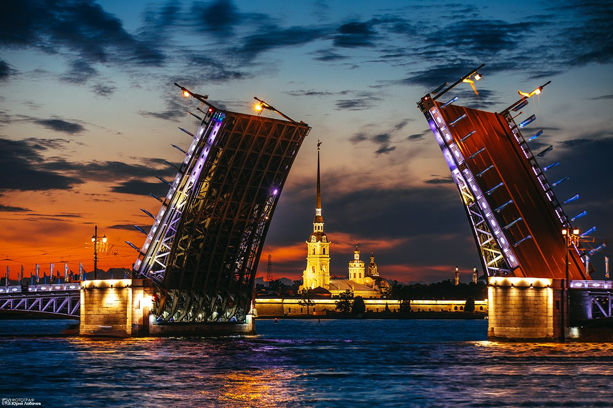
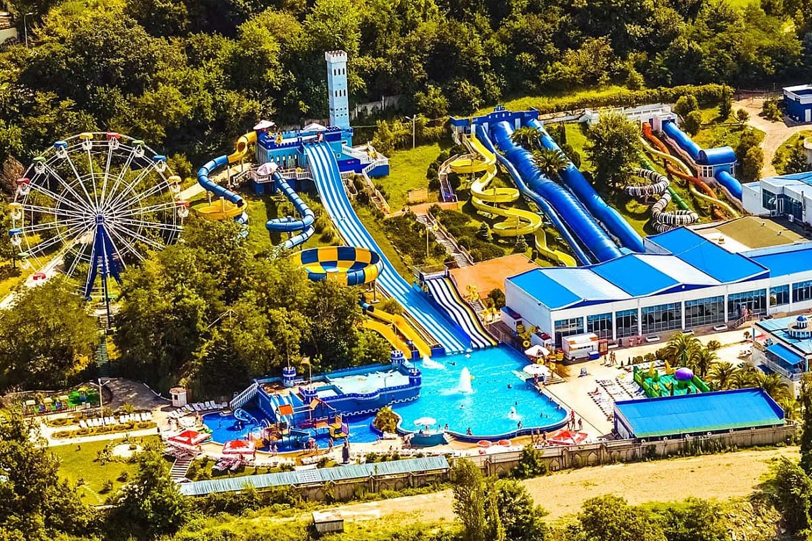

# Мой отпуск

## Поеду в **Горы**
Наконец-то, поеду в горы.
Смогу посмотреть на сизые вершины,
покататься по узорам серпантинов,
объять взором просторы долин и насытиться воздухом облаков.
___
## Посещу *Нехорошую квартиру*
В Петербурге мистическая квартира находится
на **шестом** этаже **шестиэтажного** дома
и имеет номер **66**. Весьма загадочное место.

___
## Успею
1. Увидеть красоты "бархатного" Сочи
2. Коснуться вод изумрудного Байкала
3. Другой пункт

___
## Так же в Сочи
1. Посетить "Роза Хутор"
2. Прокатиться на круизном катере
3. Сходить в Аквапарк

## Продолежение в Питире
Схожу в **Эрмитаж**

## Перелет
1. Летим на Атай
2. Посетить Телецкое озеро

